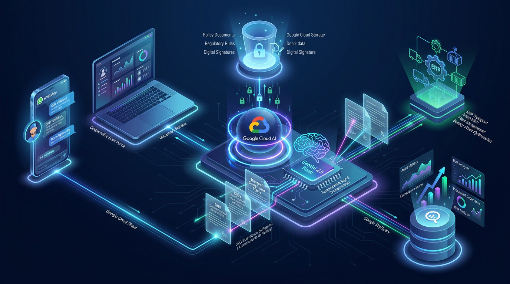
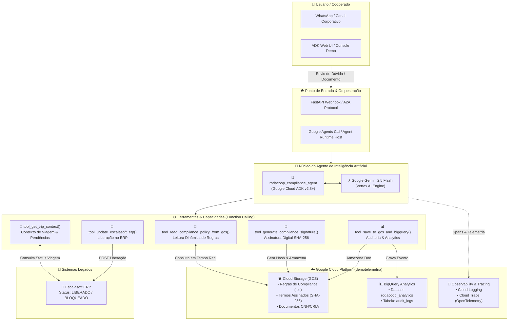

# 🏛️ Arquitetura da Solução: Agente de Compliance Documental Rodacoop

Esta demonstração apresenta a arquitetura moderna de Inteligência Artificial para agentes corporativos no Google Cloud, utilizando o novo **Agent Development Lifecycle (ADLC)** com o **Google Cloud Agent Runtime**, **Gemini 2.5 Flash** e ferramentas de governança, auditoria e telemetria nativas.

---

## 📐 Visão Geral da Arquitetura

---

## 🧩 Componentes Principais

### 1. **Camada de Interação (Frontend & Canais)**
- **WhatsApp / Webhook**: Canal onde o cooperado ou motorista envia fotos de documentos (CNH, CRLV, ANTT) e faz perguntas sobre regras de transporte interestadual.
- **ADK Web UI (Porta 8000)**: Interface de desenvolvimento e teste local para validar prompts e respostas com streaming.

### 2. **Camada de Orquestração & Runtime**
- **Google Cloud Agent Runtime / Reasoning Engine**:
  - Hospedagem serverless na região `us-central1`.
  - Recursos escaláveis de 0 a 10 instâncias com isolamento por contêiner.
  - Implementação do protocolo **A2A (Agent-to-Agent)** com publicação de `agent-card.json`.
- **Google Agents CLI (`agents-cli`)**: Padronização de scaffolding, governança de ciclo de vida e automação de deployment.

### 3. **Cérebro de IA (Vertex AI)**
- **Modelo:** `gemini-2.5-flash`
  - Alta velocidade de inferência com custo otimizado e latência reduzida.
  - Suporte multimodal nativo para extração de dados estruturados em PDFs e fotos.
  - Suporte robusto a chamadas de funções determinísticas (*Function Calling*).

### 4. **Armazenamento e Políticas Dinâmicas**
- **Google Cloud Storage (`gs://demotelemetria-compliance-docs`)**:
  - `compliance/politica_compliance_transporte.txt`: Documento que centraliza as regras da cooperativa (sem hardcode no agente). O agente lê em tempo real para responder dúvidas com fidelidade.
  - `signatures/`: Guarda os certificados digitais com hashes SHA-256, substituindo ferramentas pagas de terceiros de forma 100% nativa.
  - `uploads/`: Repositório de documentos validados.

### 5. **Auditoria & Analytics Corporativo**
- **Google BigQuery (`demotelemetria.rodacoop_analytics.audit_logs`)**:
  - Cada documento analisado, validação de regras e decisão de compliance é persistida como um evento auditável com timestamp, tipo de documento, status e metadados JSON extraídos.
  - Permite conectar Looker Studio para dashboards executivos de SLA e conformidade.

### 6. **Observabilidade Enterprise**
- **OpenTelemetry & Cloud Trace**:
  - Telemetria de agentes ativada nativamente (`GOOGLE_CLOUD_AGENT_ENGINE_ENABLE_TELEMETRY=true`).
  - Monitoramento passo a passo de cada tool chamada, tempo de resposta e consumo de tokens.

---

## 🔁 Fluxo de Execução da Demo

1. **Pergunta sobre Normas**: O usuário pergunta quais documentos são necessários para liberar transporte interestadual de grãos.
2. **Consulta Dinâmica ao GCS**: O agente aciona `tool_read_compliance_policy_from_gcs()`, lê as regras em `gs://demotelemetria-compliance-docs` e responde citando CNH com EAR, CRLV 2026, RNTRC/ANTT e SEFAZ.
3. **Validação Documental**: O usuário envia os documentos da viagem `V-98214`.
4. **Assinatura & Auditoria**: O agente gera o hash SHA-256 no Cloud Storage e grava o log no BigQuery.
5. **Liberação Integrada**: O agente dispara o webhook no Escalasoft ERP e notifica o motorista da liberação.
